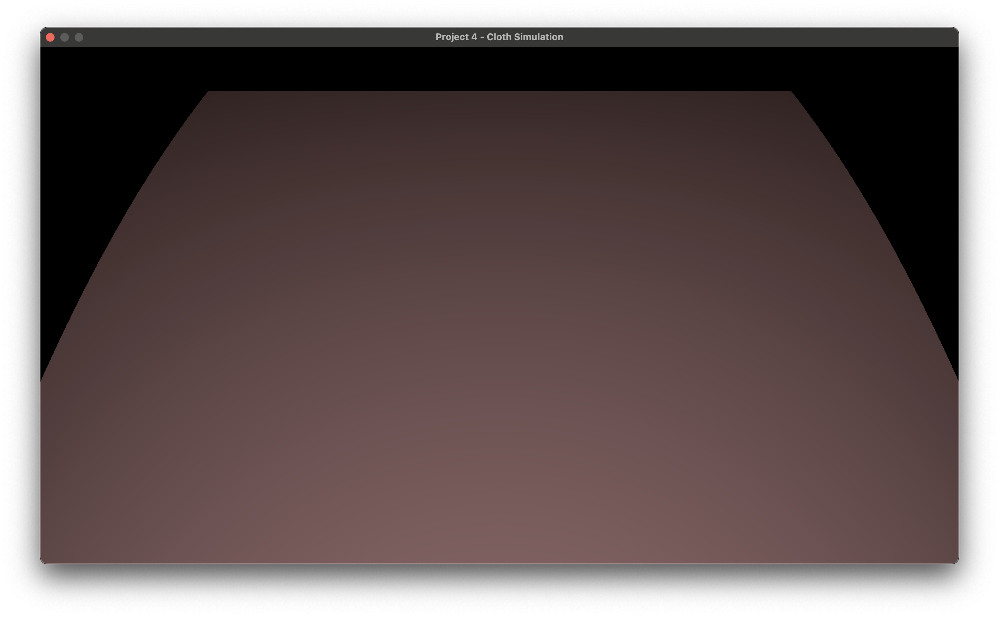

# metalcloth-pathtracing

This is a repository to document my journey in learning Metal by writing a cloth simulation and rendering the result in real-time using path tracing. It's also my homework!

This project is written in C++ using metal-cpp bindings for Metal and AppKit.

## Current State

As of Sunday February 25 2024, the project creates a 1920x1080 window and renders a pink ground plane. Only primary rays are being cast, with no lighting calculations; intersections are colored by the geometry's defined color and darkened based on distance from the camera.



## Prerequisites

- A machine running MacOS (I'm using Sonoma 14.3)
- XCode (I'm using version 15.2)
- `metal` utility available on XCode PATH
    > This can be tested by running `xcrun metal`; if your output looks like this:
    > ```
    > xcrun: error: unable to find utility "metal", not a developer tool or in PATH
    > ```
    > then running the following should make the `metal` utility available: `xcode-select --switch /Applications/Xcode.app/Contents/Developer`

## Building

Building is as simple as running `make` in the project directory.

This compiles the Metal shaders into a library (Shaders.metallib) and the project into an executable (metalcloth).

## Running

Ensuring that the shader library and executable are in the same directory, open Terminal, `cd` into the executable directory, and run `./metalcloth`.
